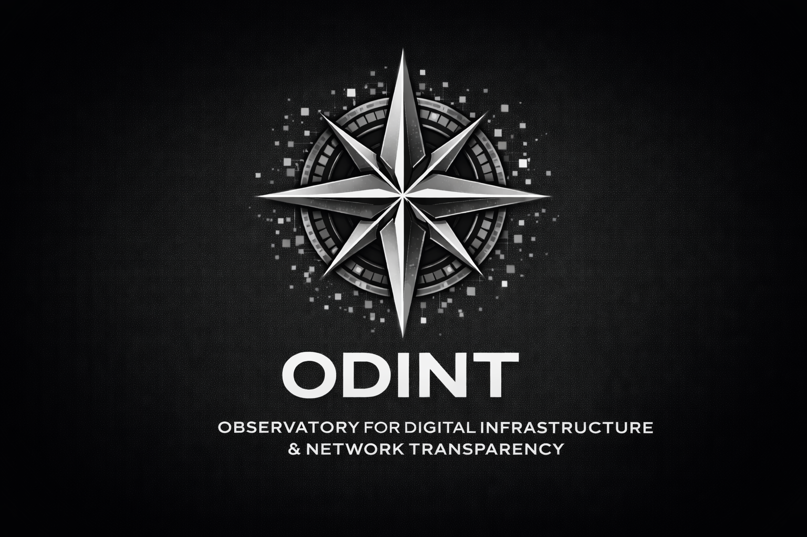

<p align="center">
  
</p>

<p align="center">
  
</p>

# ODINT — The Observatory for Digital Infrastructure & Network Transparency

**Independent. Decentralized. Nonprofit.**

ODINT is an independent, decentralized nonprofit research organization dedicated to auditing publicly accessible government digital infrastructure worldwide using open-source intelligence (OSINT) methodologies. We expose what those in power would rather keep hidden — through rigorous, reproducible, passive reconnaissance.

We don't hack. We don't exploit. We document what's already public and hold power accountable with it.

---

## Why This Repo Exists

This is our shared workspace. Our war room.

Every piece of research, every lead, every methodology, every tool reference, every dataset note — it belongs here. If it's in your head or buried in a DM, it's not helping the mission. Put it here.

**This repo is how we build on each other's work instead of working in silos.**

---

## What Goes Here

Contribute anything that moves the mission forward:

| Category | Examples |
|----------|---------|
| **Research & Findings** | Country analyses, domain inventories, API exposure notes, infrastructure maps |
| **Leads & Targets** | Government domains worth investigating, tips on exposed infrastructure, leads from the field |
| **Methodologies** | OSINT techniques, recon workflows, tool configurations, data collection procedures |
| **Tools & Resources** | Scripts, tool recommendations, browser extensions, useful databases, reference material |
| **Intelligence Notes** | Disinformation campaigns, threat actor observations, geopolitical context, regional briefings |
| **Datasets & Evidence** | Archived data, metadata dumps, certificate logs, document collections (sanitized) |
| **Policy & Legal** | Jurisdiction notes, disclosure frameworks, legal considerations by country |

If you're not sure whether something belongs — it probably does. Push it.

---

## How to Contribute

```bash
git clone https://github.com/Ringmast4r/ODINT.git
cd ODINT
```

1. Create or update files in the relevant directory
2. Use clear, descriptive filenames and commit messages
3. Push to `main` — no gatekeeping, no bureaucracy

```bash
git add .
git commit -m "Add [brief description of what you're contributing]"
git push origin main
```

**Don't overthink formatting.** Raw notes are better than no notes. A half-finished lead is better than a forgotten one. Clean it up later — get it in the repo now.

---

## Research Principles

Every ODINT contributor operates under these non-negotiable principles:

- **Passive reconnaissance only** — no active exploitation, no unauthorized access, ever
- **Public data only** — all research must be independently reproducible
- **Protect the vulnerable** — journalist and activist data is scrubbed on request within 24 hours
- **Document everything** — methodology is always published alongside findings
- **Independence** — no government or corporate influence on our research

---

## Current Focus Areas

- Government API exposure analysis
- Identity and hash correlation research
- Infrastructure mapping (DNS, SSL/TLS, CT logs)
- Document and metadata archiving
- Credential and key exposure discovery
- Authoritarian regime digital infrastructure
- Disinformation and influence operations (Indo-Pacific, Latin America)
- Border security and trafficking network intelligence
- Counterterrorism network mapping

---

## The Team

| Name | Role |
|------|------|
| Patrick Quirk | Executive Director |
| Kurt Jordan | Security Advisor |
| Joshua Graham | Physical Security Advisor |
| Ken Nevers | Cybersecurity Advisor |
| Matt Hodges | Offensive Security Advisor |
| Cory Gautereaux | Border Security & Anti-Trafficking Advisor |
| Nicholas Valencia | Counterterrorism & Threat Intelligence Advisor |
| Joaquin Camarena | Indo-Pacific Intelligence Advisor |

---

## Contact

- **Email:** odint_io@proton.me
- **Web:** [odint.io](https://odint.io)
- **Secure:** Signal available on request

---

## The Bottom Line

Transparency doesn't happen by accident. It happens because people like us do the work — methodically, ethically, and relentlessly.

If you have something that helps the mission, commit it. If you found something worth investigating, document it. If you built something useful, share it.

**This repo is only as powerful as what we put into it. Let's build something that matters.**

---

*ODINT is a Wyoming public benefit nonprofit corporation. 501(c)(3) status pending.*
